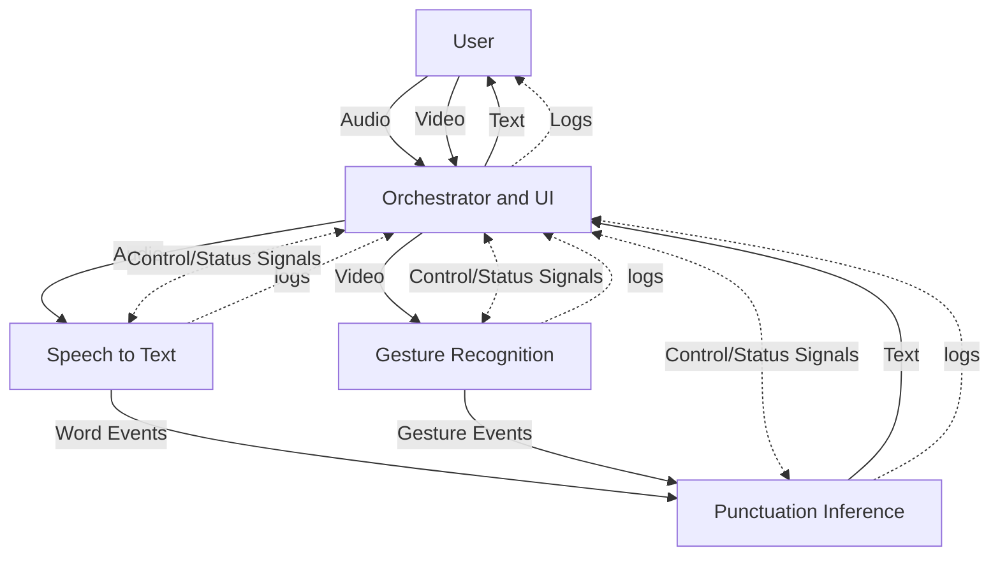
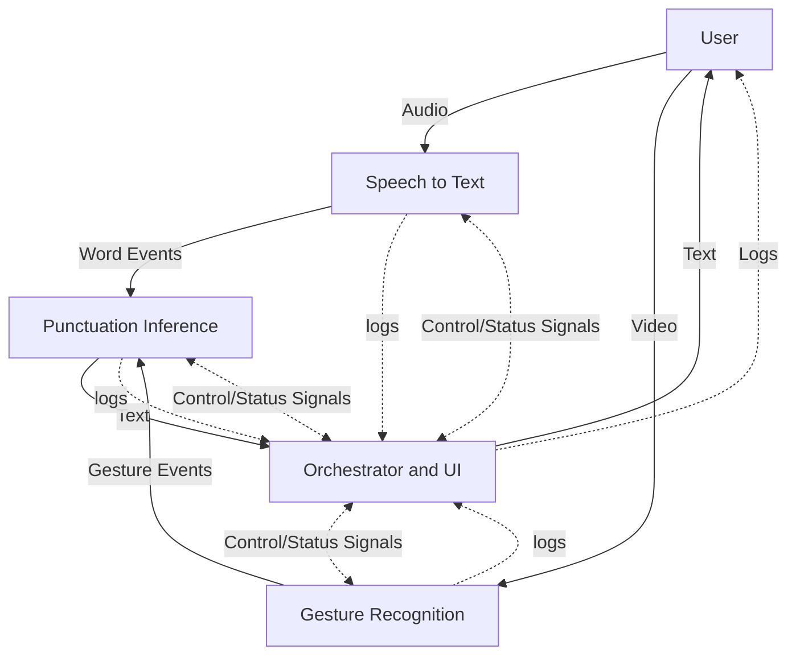
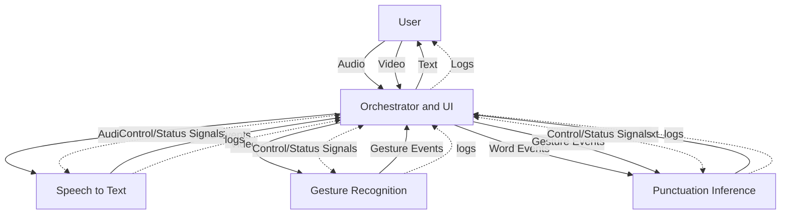

<!-- markdownlint-disable-file MD033 -->

# CSE 155 Project: Gesture Enhanced Dictation

The goal here is to solve the following problem:

> [!NOTE]
> Problem:
>
> The rate at which people can speak greatly outpaces the rate at which they can type, this causes a bottleneck in the speed at which people can write. This is especially true for people who are not able to type quickly due to physical disabilities.
> Existing dictation solutions have a huge issue with punctuation, it is very difficult to infer punctuation purely from speech. This means that existing dictation solutions are often frustrating to use as the puntuation is often wrong, or straight up missing.
> We intend to solve this issue by recording a users hand while they dictate, there will be a set of gestures that correspond to different punctuation marks, and the system will detect these gestures to place the correct punctuation in the text.

## Team Members

- Anthony Rubick
- Jesus Ruvalcaba
- Jesus Hernandez
- Alex Ascencio Hurtado
- Daniel Huynh

## High Level Design

The backend will consist of 3 main components, each operating in parallel in separate threads and communicating over channels:

- **Speech to Text**: This component will take in audio data from either a microphone or a `.wav` file and emit text segments (ideally one word long) with the duration, start time, end time, and confidence level of the transcription. We have many options for this component, including running a pre-trained model locally (such as Wav2Vec, Whisper, or Mozilla Deepspeech), or using any of the many cloud-based speech-to-text APIs available. We will likely use a local model for more control and privacy. If the model we end up using emits punctuation, we will likely remove it before passing the text segments to the next component.
- **Gesture Recognition**: This component will take in video data from a webcam or `.mp4` file and emit gesture segments with the duration, start time, end time, and peak confidence level of the gesture. We will use a pre-trained model for this component, such as OpenPose, MediaPipe, or a custom model trained on a dataset of gestures. We will likely use a pre-trained model for simplicity and the posibility of eventually allowing users to specify custom gestures.
- **Punctuation Inference**: This component will consume word and gesture evetns and emit a final text with the correct punctuation. It will use a custom algorithm to properly weave the text and gesture segments together to produce the final text. More details on this component will be given in a later section.

## Project (repo) organization

This is a monorepo that will house each component of the project in a separate directory in the project root.

There will be a script to run the test suites of each component.

## Development Plan

Here, I will outline the development plan for the project, broken up into iterative phases.

> [!NOTE]
> Phases 1,2,3 and 4 can be worked on in parallel, after defining the interfaces (data types) by which these components communicate we can develop them in isolation, with integration testing later on to ensure that they properly work together.

### Phase 0: Architecture Design

- **Goal**: Define the interfaces by which the components will communicate, and the data types that will be passed between them.

This phase involved minimal code, we will simply define the data types that will be passed between components, and the means by which they will be passed. This will allow us to develop the components in isolation, and later integrate them together.

Possibilities for communication methods include:

- Passing data between threads over channels:
  - Pro: Fast, simple, almost no overhead.
  - Con: Requires all components to be running in the same process (and therefore be implemented in the same language), this means we cannot use Python as the GIL prevents true parallelism.

- Passing data between processes over TCP/UDP or Sockets (Named Pipes on Windows or Unix Domain Sockets on Unix):
  - Pro: Allows components to be implemented in different languages, and is still relatively fast.
  - Con: More complex to implement, and adds additional overhead and latency, processes must be running on the same machine and be able to communicate over the network.
  - Con: Requires more orchistration (likely handled by a separate component) to start/stop the processes, and handle graceful shutdowns, logging, and error handling.
  - Note: despite the cons, this will likely be the best option for our purposes.

The following diagrams model possible architectures of the second approach:

<table>
<tr>
    <th></th>
    <th> Architecture A (hierarchical) </th>
    <th> Architecture B (graph-like)</th>
    <th> Architecture C (tree-like)</th>
</tr>
<tr>
<th>Diagram</th>

<td>



</td>
<td>



</td>

<td>



</td>
</tr>

<tr>
<th># sockets</th>
<td>5</td>
<td>5</td>
<td>3</td>
</tr>

<tr>
<th># edges</th>
<td>18</th>
<td>16</td>
<td>20</td>

<tr>
<th>Description</th>
<td>

In this architecture, the Orchestrator is the only component responsible for interacting with the user, it captures video / audio data and forwards it to the other components.

- Pro: Components don't need to worry about user-interaction, and can focus entirely on their specific task
- Pro: Architecture is heirachical, with the Orchestrator being the only component to interact with the user
- Con: Orchestrator is more complex, as it has greater responsibilities, but the overall complexity of the system is lower.

</td>
<td>

In this architecture, while the orchestrator is still the only component to directly communicate to the user,components like the Speech to Text and Gesture Recognition components are now responsible for capturing their own data from the user

- Pro: Orchestrator is simplified
- Pro: Components have more ownership of their data, and are less connected to the orchestrator (and are therefore easier to test)
- Con: Individual components are more complex

</td>
<td>

In this architecture, almost all inter-process communication is routed through the Orchestrator.

- Pro: less sockets to worry about, every component (other than the orchestrator) can send and receive all it's data and control/status signals through one socket
- Con: out of the 3 options, this one is the most dependent on the orchestrator.

</td>
</tr>
</table>

> [!NOTE]
> Although it is depicted as a single component, the Orchestrator may consist of multiple components to account for its distinct "routing" and "user interface" responsibilities.

#### Architecture Verdict

We will be going with the second approach and architecture B, as it is the most flexible and enables the most modular design. This will allow us to develop the components in isolation, potentially in different programming languages, and test them independently, before integrating them together.

#### Interface Specification (schema)

There are 3 main types of data that will be passed between components:

- **Word Events**: A single word, with the start time, end time, and confidence level of the transcription.
  - These will be emitted by the Speech to Text component as soon as they are available.
  - These will be consumed by the Punctuation Inference component.
- **Gesture Events**: A single gesture, with the start time, end time, and average confidence level of the gesture detection.
  - These will be emitted by the Gesture Recognition component when the gesture is detected, and when it is no longer detected, this will allow us to better handle real-time transcription.
    - when a gesture is first detected, the end time will be `None`
  - These will be consumed by the Punctuation Inference component, and the Orchestrator component.
    - Orchestrator will use these to display the gestures to the user
    - Punctuation Inference will use these to determine where to place punctuation in the text
- **Text**: A segment of text, with the punctuation inferred by the Punctuation Inference component.

The Orchestrator will be responsible for starting and stopping the other components, and for capturing logs and traces from the other components. It will also be responsible for displaying or storing these logs in a useful way in real-time.

The schema for the data types will be as follows (in rust syntax as it is the most expressive):

> [!NOTE]
> Some invariants regarding the data types:
>
> - The start time of a word or gesture event will always be less than the end time
> - The audio and video data start and end at the same time, and are synchronized.
>   - that is to say, a start time of 0 for a word event represents the same "real-world" time as a start time of 0 for a gesture event

```rust
// Word Events
struct WordEvent {
  // the word that was transcribed
  word: String,
  // start time of the word in seconds, relative to the start of the audio file
  start_time: f64,
  // end time of the word in seconds, relative to the start of the audio file
  end_time: f64,
  // confidence level of the transcription, between 0 and 1
  confidence: f64,
}

// Gesture Events
#[serde(untagged)]
enum GestureEvent {
  Start {
    // the punctuation character associated with the gesture that was detected
    punctuation: char,
    // start time of the gesture in seconds, relative to the start of the video file
    start_time: f64,
  }
  End {
    // the punctuation character associated with the gesture that was detected
    punctuation: char,
    // start time of the gesture in seconds, relative to the start of the video file
    start_time: f64,
    // end time of the gesture in seconds, relative to the start of the video file
    end_time: f64,
    // average confidence level of the gesture detection, between 0 and 1
    confidence: f64,
  }
}
// What this means is that when a gesture is first detected, end_time and confidence will 
// not be present, when the gesture is no longer detected, end_time and confidence 
// will be present
// 
// examples of the 2 variants:
// ```json
// {
//   "punctuation": "!",
//   "start_time": 0.0
// }
// ```
// ```json
// {
//   "punctuation": "!",
//   "start_time": 0.0,
//   "end_time": 1.0,
//   "confidence": 0.9
// }

// Text
struct Text {
  // the text segment with the punctuation inferred by the Punctuation Inference component
  text: String,
}
```

### Phase 1: Punctuation Inference Algorithm Design

- **Goal**: Develop, test, and validate the punctuation inference algorithm.

At this phase, the Punctuation Inference component will be developed and tested in isolation. We will feed it hand-crafted sequences of words and gestures and verify that the output it correct.

This component should emit punctuated text segments as soon as they are available, in order to support transcription as close to real-time as possible.

### Phase 2: Speech to Text Component

- **Goal**: Develop, test, and validate the Speech to Text component.

At this phase, the Speech to Text component will be developed and tested in isolation. It should be capable of listening to a microphone, or reading from a `.wav` file.

When listening from a mic, this component should be capable of real-time transcription, even if that isn't implemented by the Punctuation Inference or Orchestration Components

We will test the component with a series of `.wav` files containing speech of various speeds, volumes, accents, and background noise levels.

Tests should be strict on the word-level accuracy of the transcription, and relative ordering of words, but will be more relaxed on the exact start and end times of word segments.

### Phase 3: Gesture Recognition Component

- **Goal**: Develop, test, and validate the Gesture Recognition component.

At this phase, the Gesture Recognition component will be developed and tested in isolation. It should be capable of capturing video from a webcam, or reading from an `.mp4` file.

When capturing video from a webcam, this component should emit events as they are detected in real-time

As for the model, we can either use a pre-trained model like MediaPipe, or train a simple multi-class classifier on a dataset of gestures. We will test the component with a series of `.mp4` files containing gestures at various angles, lighting conditions, skin tones, backgrounds, etc.

### Phase 4: Orchestration Component (only required if we go for the second approach for the architecture)

- **Goal**: Develop the Orchestrator component, design the user interface, and create integration tests to verify that all components work together as expected.

At this phase, we develop the Orchestrator component, which is responsible for starting and managing the other components, and for interacting with the user. We will also design the user interface, which will likely be a CLI/TUI, or simple desktop application.

The Orchestrator must be able to start the other components, and run a health check to ensure they are running and able to communicate with their dependents.

It should be able to capture logs/traces from the other components and display or store them in a useful way in real-time.

The system must be able to gracefully shutdown all components if one crashes, ensuring that sockets are closed, files are saved, resources are released, etc.

### Phase 5: Integration Testing

- **Goal**: Verify that all components work together as expected.

Once all the components are in a working state, we should develop a suite of integration tests to ensure that they work together as expected. This will involve feeding the system a series of `.wav` and `.mp4` files containing speech and gestures, and verifying that the final text output contains the correct punctuation.

This will also be where we finalize the connection between the components, fully implementing the interfaces defined in Phase 0.

### After this point, we have something we can submit, the rest of the phases are optional, but will greatly improve the user experience and functionality of the system

Note also, these can be done out-of-order

### Stretch Goal A: Custom Gesture Recognition

- **Goal**: Allow users to define their own custom gestures for punctuation marks.

### Stretch Goal B: Generalize Gesture Recognition

- **Goal**: Generalize the Gesture Recognition component to be able to recognize hand gestures from full-body videa, or other more complicated situations, rather than just the "close up of your hand over a contrasting background" requirement.

## Work Breakdown

We have 5 members, but 3 main components, thus work will be divided as follows:

- **Speech to Text**: 2 members
- **Gesture Recognition**: 2 members
- **Punctuation Inference**: 1 member
  - Anthony Rubick

Once these components reach a working state, a member of both the Speech to Text and Gesture Recognition teams will be reassigned to work on the Orchestrator and User Interface.

Note that overall, everyone will be able to contribute to the design and testing of all components, the above breakdown mearly reflects the *primary* responsibility of each member.

If someone finishes their portion early, they can begin working on the orchestrator, and/or helping another team that is falling behind

## More detailed notes/considerations on each component

### Gesture Recognition

Considerations:

- runtime dominated by image processing tasks and external CV model
- should have very low latency to enable real-time inference
- has a single "read, process, emit" architecture
- will interface with external (cpp) libraries (assuming we don't choose cpp)

Language choice: ...

Reason for that choice: ...

Major libraries/frameworks/technologies (if applicable): ...

### Speech to Text

Considerations:

- runtime dominated by external ASR model
- should be very low latency to enable real-time inference
- has a single "read, process, emit" architecture
- will interface with external (cpp) libraries (assuming we don't choose cpp)

Language choice: ...

Reason for that choice: ...

Major libraries/frameworks/technologies, with descriptions of what they are and why we use them (if applicable): ...

### Punctuation Inference

Language considerations:

- High traffic node, robustness is important
- performance of the language is important, the runtime will be dominated by data processing
- component depends on data emitted by other components
- likely won't interface with external libraries

Language choice: `Rust`

Reason for that choice:

- It is important that this component be both robust and performant, rust is both.
- Won't be needing many external libraries, support not as much as a factor
- the components dependencies on data emitted by other components make it a good spot to catch any formatting errrors in the emitted data, rust's strong type system makes it trivial to ensure that data is what we expecct it to be, and to write code that can only fail if it can't process input data (that is, can only fail if another component messed up).
- The component doesn't interface with external cpp libraries, so we don't need to worry about rusts short comings with cpp interop.

Major libraries/frameworks/technologies, with descriptions of what they are and why we use them (if applicable): ...

### Orchestrator

Considerations:

- High traffic node, robustness is important
- This is the most important component in the system, that is to say, it must not panic.
  - Errors must be handled gracefully to avoid leaving dangling sockets or zombie processes.
- This component acts mostly as a router, so performance, while important, is not a primary consideration
- Language should support true parallelism, as a high-traffic node in the system, this component should be able to process multiple requests simultaneously
- likely won't need to interface with external libraries, ergonomics of inter-oping with cpp is not as important

Language choice: ...

Reason for that choice: ...

Major libraries/frameworks/technologies, with descriptions of what they are and why we use them (if applicable): ...
