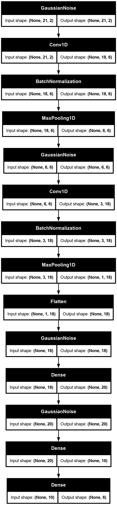
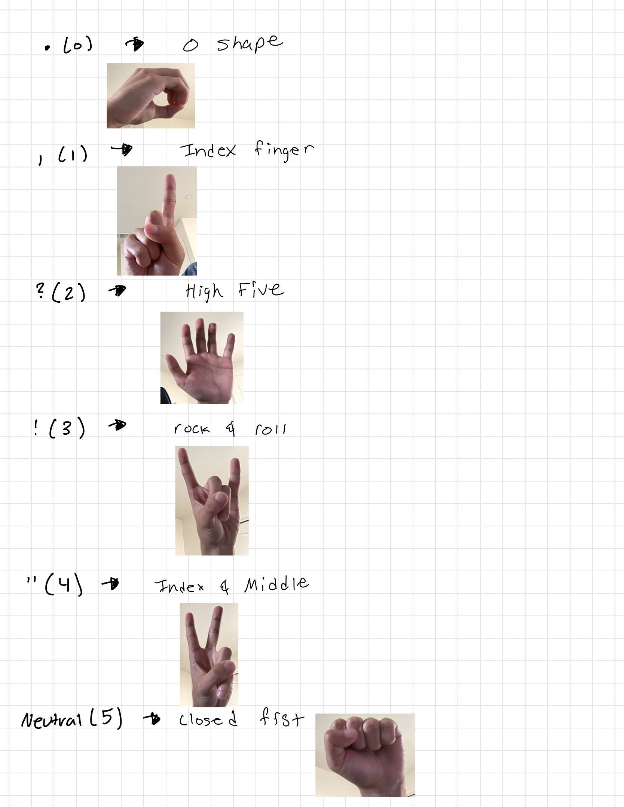
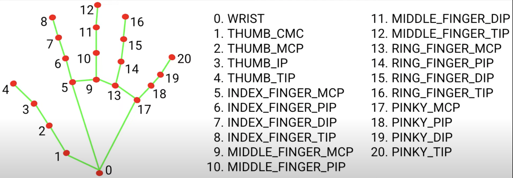

# Gesture Recognition

>[!note]
>if the container is crashing due to a QT error, ensure X11 fowarding is enabled on the host by running:
>
>```bash
>xhost +local:
>```

## Model



## Usage

### gestures



## directory structure

### app.py

This is a sample program for inference.

In addition, learning data (key points) for hand sign recognition,

You can also collect training data (index finger coordinate history) for finger gesture recognition.

### keypoint_classification.ipynb

This is a model training script for hand sign recognition.

### model/keypoint_classifier

This directory stores files related to hand sign recognition.

The following files are stored.

* Training data(keypoint.csv)
* Trained model(keypoint_classifier.tflite)
* Label data(keypoint_classifier_label.csv)
* Inference module(keypoint_classifier.py)

### utils/cvfpscalc.py

This is a module for FPS measurement.

## Training

Hand sign recognition and finger gesture recognition can add and change training data and retrain the model.

### Hand sign recognition training

#### 1.Learning data collection

Start the program with the `MODE` environment variable set to `KEYPOINT_TRAINING`.


If you press "0" to "9", the key points will be added to "model/keypoint_classifier/keypoint.csv" as shown below.

1st column: Pressed number (used as class ID), 2nd and subsequent columns: Key point coordinates.


The key point coordinates are the ones that have undergone the following preprocessing up to ④.



In the initial state, three types of learning data are included: open hand (class ID: 0), close hand (class ID: 1), and pointing (class ID: 2).

If necessary, add 3 or later, or delete the existing data of csv to prepare the training data.


#### 2.Model training

Open "[keypoint_classification.ipynb](keypoint_classification.ipynb)" in Jupyter Notebook and execute from top to bottom.

To change the number of training data classes, change the value of "NUM_CLASSES = 3"

and modify the label of "model/keypoint_classifier/keypoint_classifier_label.csv" as appropriate.

#### X.Model structure

The image of the model prepared in "[keypoint_classification.ipynb](keypoint_classification.ipynb)" is as follows.
<br><br>

# License

This component was build off of the work of Kazuhito Takahashi and Nikita Kiselov. The original work can be found [here](https://github.com/kinivi/hand-gesture-recognition-mediapipe) and is licensed under the [Apache v2 license](LICENSE).
